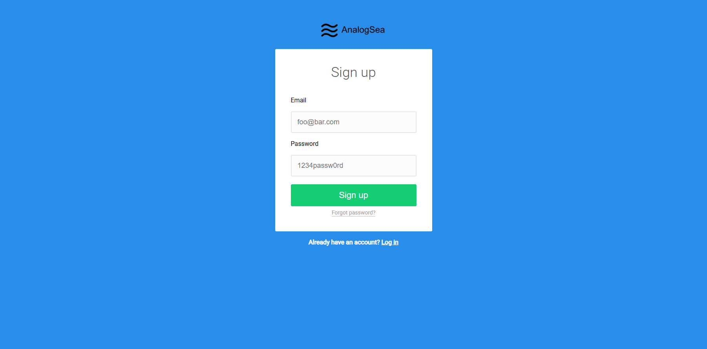

# 🌊 AnalogSea – Sign Up Page

Live Site: https://edaviesc.github.io/analog_sea/



---

## 📌 Project Overview

AnalogSea is a clean and modern sign-up page interface designed with simplicity and clarity in mind.  
The project focuses on structured layout, centered form design, and strong visual hierarchy.

This page simulates a user registration experience with email and password inputs, a primary call-to-action button, and supporting navigation links.

---

## 🎯 Features

- Centered card layout
- Email and password input fields
- Primary “Sign Up” button
- Forgot password link
- Login redirect link
- Clean blue background with minimal branding
- Responsive and user-friendly UI

---

## 🛠️ Built With

- HTML5
- CSS3
- GitHub Pages (Deployment)

---

## 🎨 Design Highlights

- Strong visual contrast between background and form card
- Clear typography hierarchy
- Simple, distraction-free interface
- Accessible form structure
- Modern flat design styling

---

## 📂 Project Structure

```plaintext
analog_sea/
│
├── index.html
├── styles.css
└── README.md
└── LICNSE.md
```


---

## 🚀 Deployment

This project is deployed using **GitHub Pages**.

To deploy your own version:

1. Push project to GitHub repository
2. Go to Settings
3. Select Pages
4. Choose main branch
5. Save and publish

---

## 📖 Purpose

This project demonstrates:

- Front-end layout structuring
- Form styling best practices
- Clean UI design principles
- Beginner-friendly web development skills

---

## 👤 Author

**Emlyn Davies-Cole**  
Architectural Designer transitioning into Web Development  
Focused on structured thinking, visual clarity, and user-centered design.

---

## 📌 Future Improvements

- Add form validation
- Add backend authentication
- Improve accessibility (ARIA labels)
- Add mobile responsiveness refinements

---
